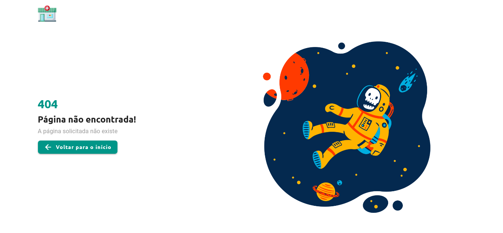

# :pill: Pharma .Inc

- Desafio front-end developer 2021, proposto pela [Coodesh](https://coodesh.com/).

## :tv: Telas da aplicação

- **Home**, onde é listado os pacientes vindos da API [Random User Generator](https://randomuser.me/).


- **Dialog** de informações do paciente selecionado.


- **Detalhes do paciente** com URL para compartilhamento.


- **Página não encontrada**, caso o paciente acesse uma rota que não exista na aplicação.



## :computer: Tecnologias, frameworks e ferramentas utilizadas:

- [Vue.js](https://br.vuejs.org/)
- [Vuex](https://vuex.vuejs.org/)
- [Vuetify](https://vuetifyjs.com/en/)
- [SASS](https://sass-lang.com/)
- [Axios](https://axios-http.com/)
- [Typescript](https://www.typescriptlang.org/)

## :hammer: Configuração do projeto

### :heavy_check_mark: Pré-requisitos:

- [Git](https://git-scm.com/)
- [Node.js](https://nodejs.org/en/)
- [Yarn](https://yarnpkg.com/)
- Editor de código (Recomendo utilizar o [VSCode](https://code.visualstudio.com/))

## :rocket: Rodando a aplicação localmente

### :one: Clone o repositório

- Utilizando HTTPS:
```
git clone https://github.com/Lucas98Fernando/pharma-coodesh-challenge.git
```

- Utilizando SSH:
```
git clone git@github.com:Lucas98Fernando/pharma-coodesh-challenge.git
```

### :two: Instalar as dependências do projeto

```
npm install
```

ou somente:

```
npm i
```

### :three: Compilação e hot-reload para ambiente de desenvolvimento

```
npm run serve
```

- Após concluir os passos anteriores, acesse: http://localhost:8080

- **Maravilha!** Você poderá utilizar a aplicação :smile:

### :four: Compilar e minificar para produção

```
npm run build
```

### :five: Executar os testes unitários

```
npm run test:unit
```

### :six: Executar os testes "end-to-end" 

```
npm run test:e2e
```

### :seven: Lints e corrigir arquivos

```
npm run lint
```

### Customizar configuração

Ver [Referência de Configuração ](https://cli.vuejs.org/config/).
